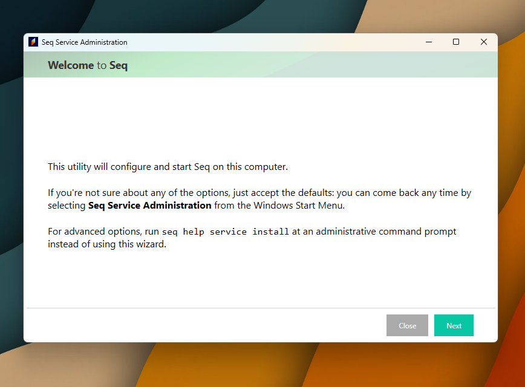
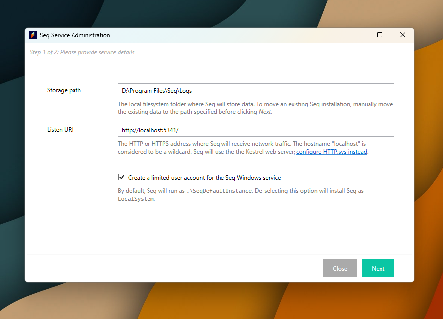
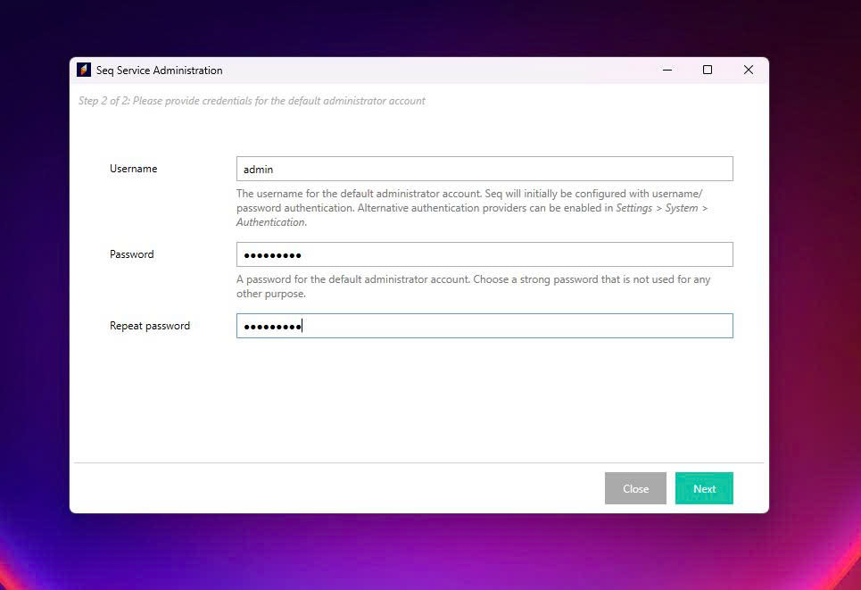
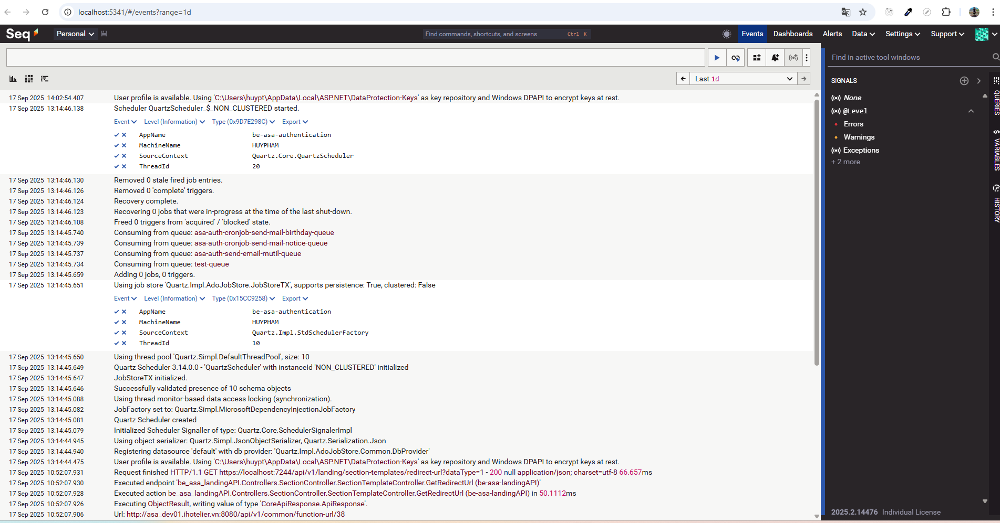

# 🚀 Hướng dẫn cài đặt Seq & tích hợp ASP.NET Core

## 📑 Mục lục
- [1. Giới thiệu Seq](#1-giới-thiệu-seq)
- [2. Cài đặt Seq](#2-cài-đặt-seq)  
  - [2.1 Windows](#21-windows)  
  - [2.2 Docker](#23-docker)
  - [2.3 Setting](#23-setting)
    - [2.3.1 Local](#231-local)
    - [2.3.2 IIS](#232-iis)
- [3. Tích hợp Seq với ASP.NET Core](#3-tích-hợp-seq-với-aspnet-core)  
  - [3.1 Cài đặt NuGet](#31-cài-đặt-nuget)  
  - [3.2 Cấu hình appsettingsjson](#32-cấu-hình-appsettingsjson)  
  - [3.3 Programcs](#33-programcs)  
  - [3.4 Ví dụ log trong Controller](#34-ví-dụ-log-trong-controller)  
- [4. Truy cập Seq](#4-truy-cập-seq)

---

## 1. Giới thiệu Seq
- **Seq** là log server giúp thu thập, phân tích và trực quan hóa log ứng dụng.
- Thường dùng với **Serilog** trong .NET, hỗ trợ query log mạnh mẽ (gần giống SQL).
- Website: [https://datalust.co/seq](https://datalust.co/seq)

## 2. Cài đặt Seq
### 2.1 Windows 
1. Tải bộ cài tại: [https://datalust.co/download](https://datalust.co/download)  
2. Cài đặt vào thư mục mong muốn, ví dụ: D:\Program Files\Seq
3. Sau khi cài xong, thêm đường dẫn vào **Environment Variables**
   - `PATH`: D:\Program Files\Seq\
   - `PATH`: D:\Program Files\Seq\Client\
5. Mặc định chạy tại: [http://localhost:5341](http://localhost:5341). 

### 2.2 Cài đặt bằng Docker
Chạy container Seq với lệnh sau:
- Lệnh
```bash
docker rm -f seq
docker run -d --name seq `
  -e ACCEPT_EULA=Y `
  -e SEQ_FIRSTRUN_ADMINPASSWORD=Password123 `
  -p 5341:80 datalust/seq:latest
```
- Tài khoản và Mật khẩu mặc định
```cmd
admin
```
```cmd
Password123
```
- Sau khi đănh nhập lần đầu tiên thì đổi mật khẩu

### 2.3 Setting
#### 2.3.1 Local
- Sau khi hoàn thành các bước trên thì seq sẽ hiện lên UI setup
- Nếu sau khi cài nó không hiện lên UI setup có thể search seq trên thanh tìm kiếm windown để mở




#### 2.3.2 IIS
## 3. Tích hợp Seq với ASP.NET Core
Các file logs được lưu vào wwwroot/Logs
### 3.1 Cài đặt NuGet
Cài các package cần thiết:

```bash
dotnet add package Serilog.AspNetCore 
dotnet add package Serilog.Enrichers.Environment 
dotnet add package Serilog.Enrichers.Thread 
dotnet add package Serilog.Sinks.Console 
dotnet add package Serilog.Sinks.File 
dotnet add package Serilog.Sinks.Seq 
```
### 3.2 Cấu hình appsettings.json
```bash
"Serilog": {
  // Chọn các sink để ghi log (Console, File, Seq)
  "Using": [ "Serilog.Sinks.Console", "Serilog.Sinks.File", "Serilog.Sinks.Seq" ],

  // Mức log mặc định và tùy chỉnh theo namespace
  "MinimumLevel": {
    "Default": "Information",                // Ghi log từ mức Information trở lên
    "Override": {
      "Microsoft": "Warning",                // Bỏ bớt log lặt vặt từ Microsoft
      "Microsoft.AspNetCore": "Information", // Vẫn log request/response ASP.NET
      "System": "Warning",                   // Hạn chế log hệ thống
      "Microsoft.EntityFrameworkCore": "Warning" // Tránh spam query EF
    }
  },

  // Thêm thông tin enrich vào log
  "Enrich": [ 
    "FromLogContext",   // Cho phép attach context (UserId, CorrelationId)
    "WithMachineName",  // Ghi tên máy chạy app
    "WithThreadId"      // Ghi thread id (debug đa luồng)
  ],

  // Gắn property mặc định cho toàn bộ log
  "Properties": {
    "AppName": "my-aspnet-app" // Giúp phân biệt app khi nhiều app đẩy log vào Seq
  },

  // Nơi ghi log (có thể nhiều sink)
  "WriteTo": [
    { "Name": "Console" }, // Log ra terminal / docker logs
    {
      "Name": "File",      // Log ra file
      "Args": {
        "path": "Logs/log-.txt",        // Đường dẫn log
        "rollingInterval": "Day",       // Tạo file mới mỗi ngày
        "retainedFileCountLimit": 30,   // Giữ tối đa 30 file log
        "shared": true                  // Cho phép nhiều process ghi chung
      }
    },
    {
      "Name": "Seq",       // Đẩy log tới Seq server
      "Args": {
        "serverUrl": "http://localhost:5341" // URL Seq (local hoặc docker)
      }
    }
  ]
}
```
### 3.3 Program.cs
```bash
using Serilog;

var builder = WebApplication.CreateBuilder(args);

// Đọc config từ appsettings.json
builder.Host.UseSerilog((context, services, configuration) =>
    configuration.ReadFrom.Configuration(context.Configuration)
                 .ReadFrom.Services(services)
                 .Enrich.FromLogContext());

var app = builder.Build();

app.MapControllers();
app.Run();

```
### 3.4 Ví dụ log trong Controller
```bash
using Microsoft.AspNetCore.Mvc;
using Microsoft.Extensions.Logging;

[ApiController]
[Route("[controller]")]
public class TestController : ControllerBase
{
    private readonly ILogger<TestController> _logger;

    public TestController(ILogger<TestController> logger)
    {
        _logger = logger;
    }

    [HttpGet]
    public IActionResult Get()
    {
        _logger.LogInformation("Hello from ASP.NET Core with Seq!");
        return Ok("Log đã được ghi vào Seq");
    }
}

```

